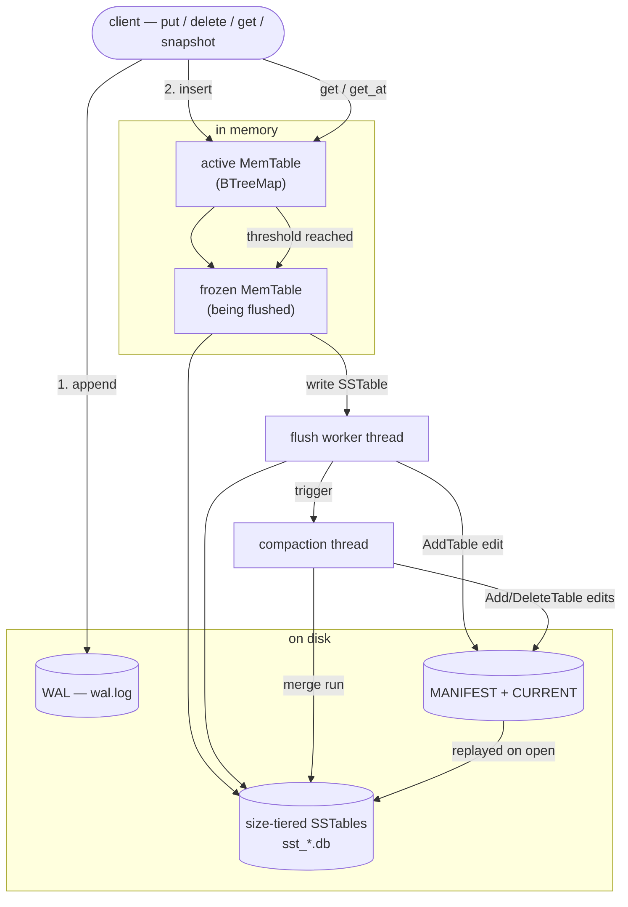

# lsm_kv

A log-structured merge-tree key/value storage engine in Rust — the storage
architecture behind RocksDB, LevelDB and Cassandra — built from scratch with a
write-ahead log, Bloom-filtered block SSTables, size-tiered compaction, a
crash-safe manifest, concurrent reads/writes, background flush & compaction, and
point-in-time snapshots.

```rust
use lsm_kv::Db;

let db = Db::open("./data")?;
db.put(b"hello", b"world")?;
assert_eq!(db.get(b"hello")?, Some(b"world".to_vec()));

let snap = db.snapshot();          // pin a point in time
db.put(b"hello", b"changed")?;
assert_eq!(db.get(b"hello")?,        Some(b"changed".to_vec()));
assert_eq!(db.get_at(&snap, b"hello")?, Some(b"world".to_vec()));
```

## Architecture



**Write path.** Every mutation is appended to the WAL and inserted into the
active MemTable under one lock, so it is durable before it is visible. When the
MemTable crosses its size threshold it is *frozen* — swapped for a fresh one —
and a background worker writes it to an immutable SSTable. Writers never block
on flush I/O.

**Read path.** A lookup checks the active MemTable, then the frozen MemTable,
then SSTables newest-to-oldest. Each SSTable consults a per-table Bloom filter
before touching any block, binary-searches a sparse block index, and decodes a
single LZ4-compressed ~4 KiB block (cached in memory).

**Durability.** A `MANIFEST` — an append-only log of version edits, the LevelDB
model — is the authoritative record of the live SSTable set and the global
sequence/id counters. On open it is replayed, orphan files from an interrupted
flush or compaction are reclaimed, and the WAL replays anything not yet flushed.

**Compaction.** A dedicated thread merges size-tiered runs of SSTables to bound
read and space amplification. The heavy k-way merge runs lock-free; only the
publish step briefly serializes with flushes.

**Snapshots.** A snapshot pins a sequence-number horizon; reads through it see
only earlier writes. Compaction preserves every record version a live snapshot
can still observe.

## On-disk format

| File | Contents |
|---|---|
| `CURRENT` | ASCII name of the live `MANIFEST-<gen>` file |
| `MANIFEST-<gen>` | append-only version-edit log: `[crc32][len][tag+body]` frames |
| `wal.log` | append-only write-ahead log: `[crc32][len][record]` frames |
| `sst_<id>.db` | LZ4 data blocks · sparse block index · Bloom filter · footer |

A record is `[seq:8][type:1][key_len:4][key][val_len:4][val]`; every WAL frame
and data block is CRC- or LZ4-framed, and replay stops cleanly at the first torn
trailing frame from a crash mid-append.

## Status

Phases 1–3 are complete:

- **Phase 1** — WAL, MemTable, SSTables, crash recovery.
- **Phase 2** — per-SSTable Bloom filters, block-based compressed SSTables,
  size-tiered compaction, benchmarks vs RocksDB.
- **Phase 3** — crash-safe manifest, `Send + Sync` `&self` API with concurrent
  reads/writes, background flush & compaction, point-in-time snapshots,
  property tests and fuzz targets.

## Benchmarks

Measured with [criterion](https://github.com/bheisler/criterion.rs) against an
in-process RocksDB baseline — full numbers and methodology in
[BENCHMARKS.md](BENCHMARKS.md). Headline figures (Apple M2 Pro):

| Workload | `lsm_kv` vs RocksDB |
|---|---|
| YCSB A (50/50 read/write), uniform | 64% |
| YCSB A (50/50 read/write), zipfian | 111% |
| YCSB C (100% read), zipfian | 39% |

Write-heavy workloads are competitive; uniform read-heavy workloads are the
known weak spot (see *What's missing*).

```sh
cargo bench --bench engine     # engine microbenchmarks
cargo bench --bench ycsb       # YCSB A/B/C vs RocksDB
```

## Design decisions

**Size-tiered over leveled compaction.** Size-tiered merges runs of
similarly-sized tables: simpler, write-optimized, and a clean fit for a
from-scratch engine. Leveled compaction gives lower read amplification but needs
per-level key-range bookkeeping — deferred as future work.

**A manifest, after id-ordering.** Phase 2 reconstructed state by scanning the
directory and inferring sequence numbers from the WAL, which meant `next_seq`
reset after a clean flush. Snapshots need globally-ordered sequence numbers, so
Phase 3 introduced the manifest as the authoritative, crash-safe spine.

**Design B snapshots.** The MemTable stays one-version-per-key; older versions
are preserved on disk (one per flush generation) and shielded from compaction
while a snapshot can see them. The trade-off: a snapshot taken between two
writes of the *same key*, while both are still in the *active* MemTable, cannot
see the older one. Full MVCC (a multi-version MemTable) would close this gap at
the cost of a larger rewrite.

**Single WAL, rewritten after flush.** One `wal.log` is rewritten to back only
post-freeze records once a flush is durable, rather than rotating a file per
MemTable generation — fewer files, simpler recovery.

## What's missing

Honest gaps between this and a production engine:

- **No leveled compaction** — uniform read-heavy workloads pay for it (see
  benchmarks).
- **Writes serialize on the WAL mutex** — throughput is single-writer; a
  production engine batches WAL appends from a group of writers.
- **Design B snapshot window** — see *Design decisions* above.
- **Long-lived snapshots pin space** — compaction cannot reclaim versions a
  snapshot still sees.
- **No range scans, transactions, or MVCC iterators.**
- **No per-block data checksums** beyond the LZ4 frame and the WAL/manifest
  CRCs.

## Building & testing

```sh
cargo test                              # unit, property, and crash tests
cargo build --release                   # optimized library + `lsm` CLI

cargo +nightly fuzz run record_decode    # fuzz the decoders (needs cargo-fuzz)
cargo +nightly fuzz run wal_replay
cargo +nightly fuzz run sstable_open
```

The `lsm` CLI is a thin smoke-test wrapper:

```sh
lsm ./data put hello world
lsm ./data get hello
lsm ./data delete hello
lsm ./data flush
```
